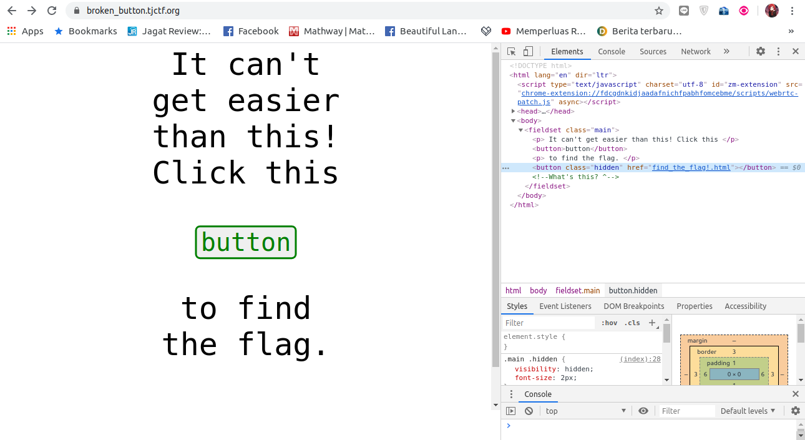
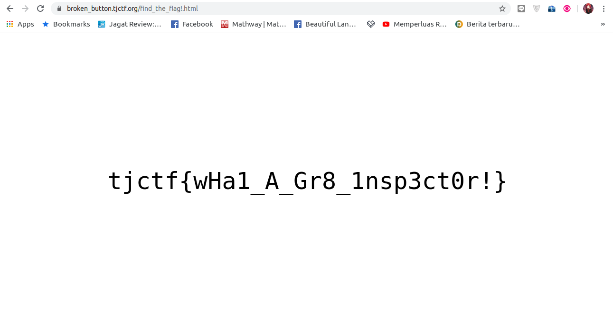

# Broken Button - 10 points
## Description
This [site](http://broken_button.tjctf.org/) is telling me all I need to do is click a button to find the flag! Is it really that easy?
## Flag
```
tjctf{ch0p1n_fl4gs}
```
## Solution


Setelah kita buka `inspect element` pada halaman ini, maka akan ditemukan `hidden button` yang menuju halaman lainnya.



Ketika terbuka, ternyata berisi flag yang dicari.
