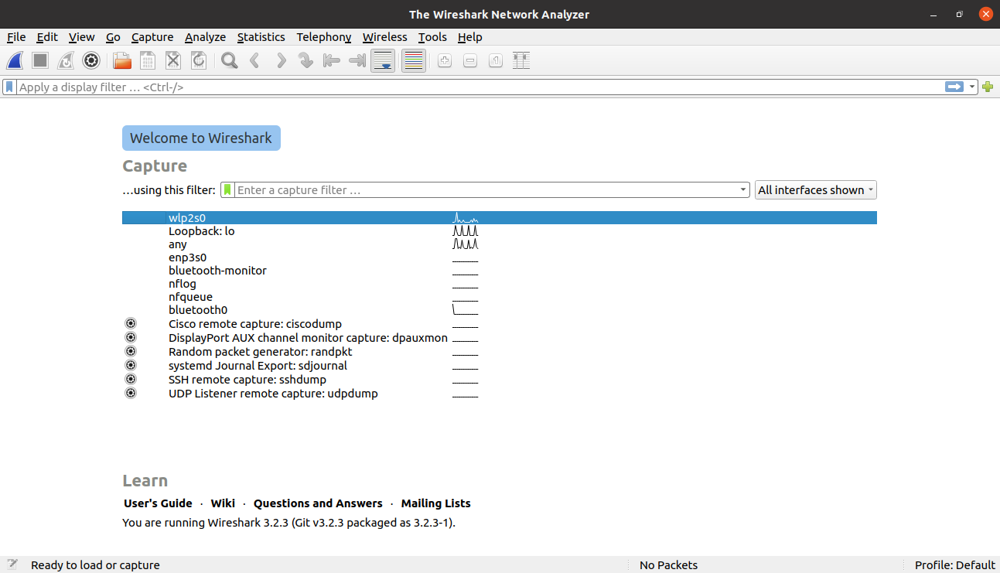
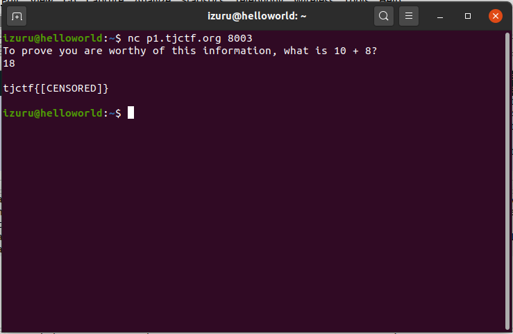
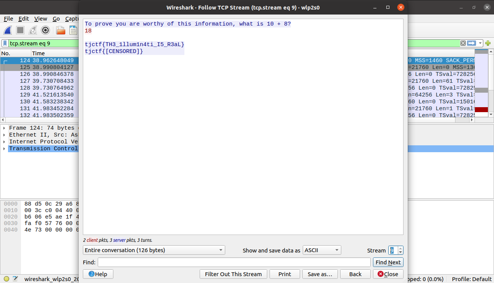

# Censorship - 30 points
## Description
My friend has some top-secret government intel. He left a message, but the government censored him! They didn't want the information to be leaked, but can you find out what he was trying to say?

`nc p1.tjctf.org 8003`
## Flag
```
tjctf{TH3_1llum1n4ti_I5_R3aL}
```
## Solution


Sebelum mengeksekusi `netcat` kita harus membuka wireshark terlebih dahulu agar dapat diketahui apa pesan rahasia yang ingin disampaikan.



Setelah `netcat` dijalankan jawablah dengan benar sampai program berhenti.



Kembali ke wireshark, lacak `TCP` nya dengan melihat `Follow -> TCP Stream`. Ditemukanlah flagnya.
