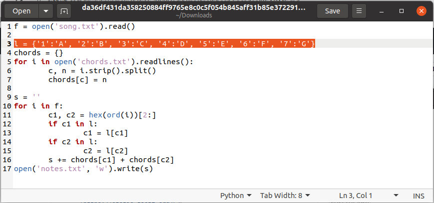

# Chord ENcoder - 40 points
## Description
I tried creating my own [chords](https://static.tjctf.org/67be5bd036a4be8323314d1da6ad2e673963f76634a62ec47d53fb07a04a3722_chords.txt), but my [encoded sheet music](https://static.tjctf.org/c29857b8d4d1b2dfe502b5053d73844a08358ae681b2af8de6829b765dc2c28e_notes.txt) is a little hard to read. Please play me my song!

[chord_encoder.py](https://static.tjctf.org/da36df431da358250884ff9765e8c0c5f054b845aff31b85e37229159176bb9f_chord_encoder.py)

## Flag
```
flag{zats_wot_1_call_a_meloD}
```
## Solution


Setelah mengunduh gambar, dapat dilihat gambar tersebut adalah meme dengan not balok Chopins Third Ballade. Dari soal dapat diketahui yang dicari adalah pembuat dari meme tersebut. Untuk mendapatkan data tersebut dapat menggunakan `exiftool` dan grep pada `terminal`. 
```
$ exiftool [imagename].png | grep Artist
```
