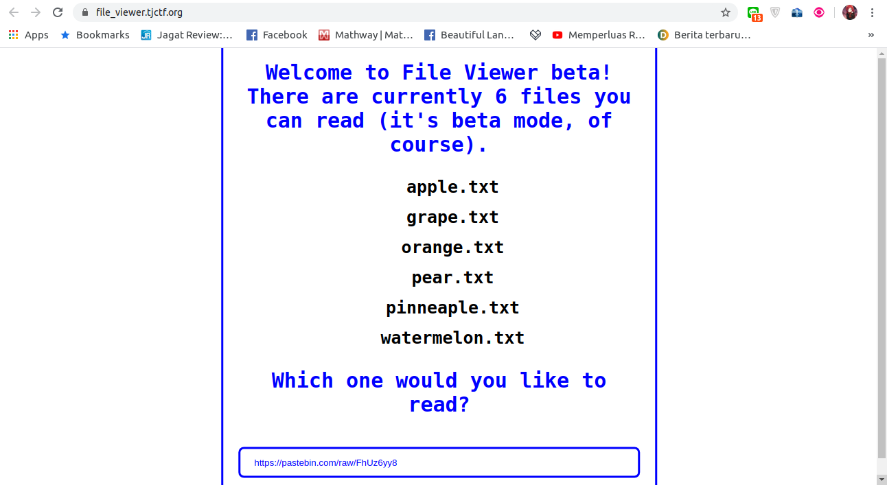
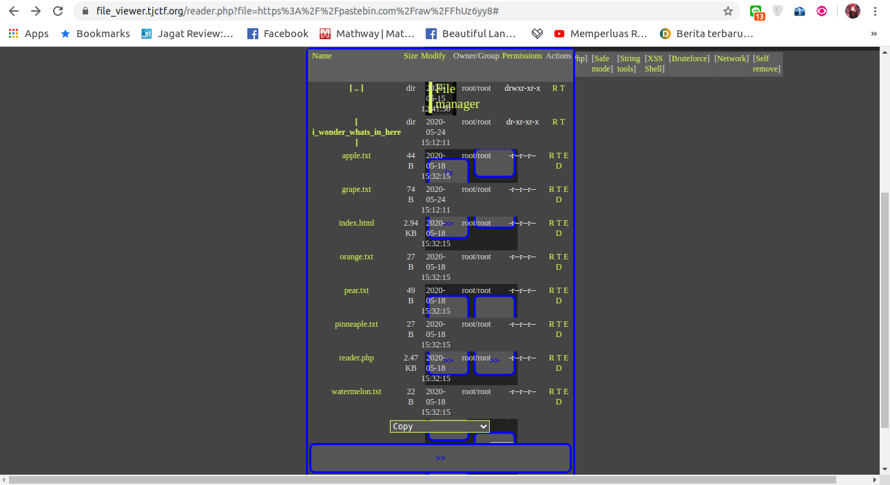

# File Viewer - 70 points
## Description
So I've been developing this really cool [site](https://file_viewer.tjctf.org/) where you can read text files! It's still in beta mode, though, so there's only six files you can read.
## Flag
```
tjctf{n1c3_j0b_with_lf1_2_rc3}
```
## Solution


Saya penasaran apa situs ini mampu membaca pastebin yang berisi file manager. Dan ternyata memang bisa. Akhirnya saya mencoba mencari salah satu file manager yang mampu membaca tidak hanya file, namun juga folder. Linknya `https://pastebin.com/raw/FhUz6yy8`



Walaupun sedikit kacau, namun ini merupakan file manager terbaik yang saya temukan. Selanjutnya tinggal membuka folder `i_wonder_whats_in_here` dan akan menemukan file `flag.php` yang berisi flagnya.
