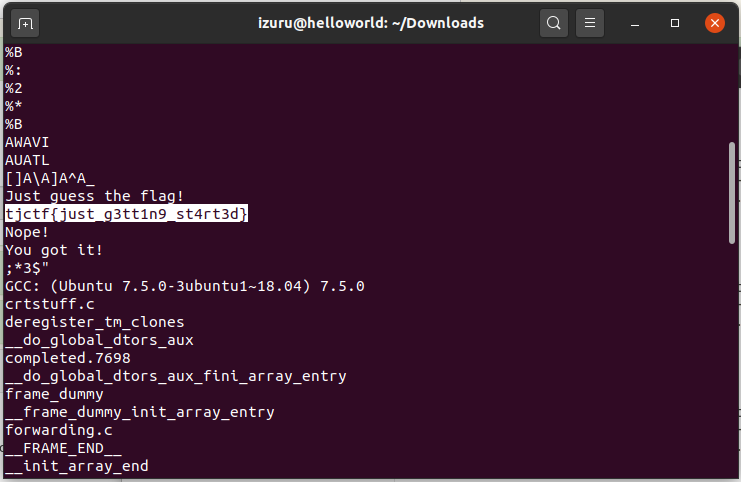

# Forwarding - 10 points
## Description
It can't be that hard... right?

[forwarding](https://static.tjctf.org/d9c4527bc1d5c58c1192f00f2e2ff68f84c345fd2522aeee63a0916897197a7a_forwarding)
## Flag
```
tjctf{just_g3tt1n9_st4rt3d}
```
## Solution


Setelah mengunduh file yang dilampirkan pada soal, maka kita tinggal menggunakan `strings` pada `terminal` dan akan muncul flag seperti pada gambar. Bisa juga ditambahkan dengan `grep` namun sayangnya saya sudah ketemu flagnya sebelum ingat dengan tambahan `grep`. Command yang saya pakai:
```
$ strings  d9c4527bc1d5c58c1192f00f2e2ff68f84c345fd2522aeee63a0916897197a7a_forwarding
```
atau bisa
```
$ strings  d9c4527bc1d5c58c1192f00f2e2ff68f84c345fd2522aeee63a0916897197a7a_forwarding | grep tjctf{
```
