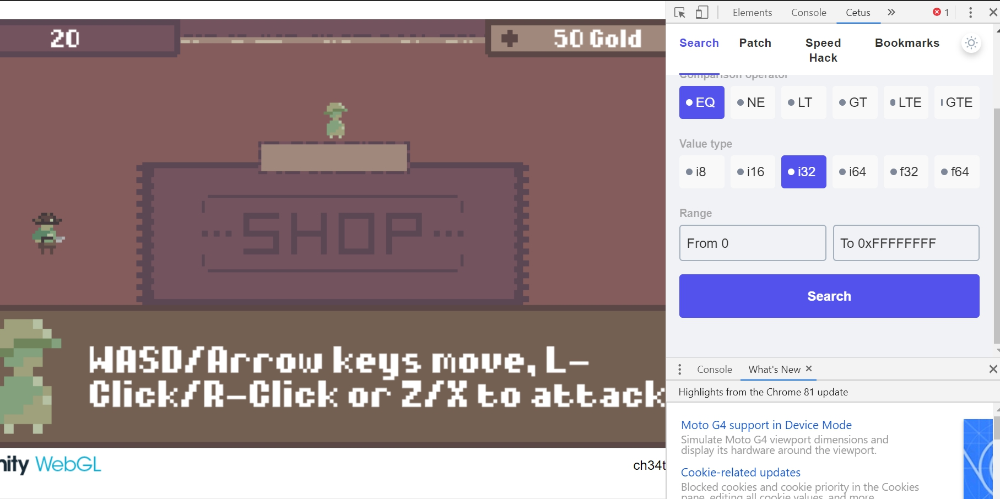

# Gamer W - 60 points
## Description
Can you figure out how to [cheat](http://gamer_w.tjctf.org/) the system? Grab his hat to prove your victory!
## Flag
```
tjctf{c3tus_del3tus_ur_m3ms_g0ne}
```
## Solution

Pada game tersebut diberitahu bahwa harus menggunakan chrome extension `Cetus` yang dapat diunduh dari [sini](https://github.com/Qwokka/Cetus). Cetus dimanfaatkan untuk memanipulasi game tersebut. Ketika awal bermain kita bisa membuka cetus seperti pada gambar diatas.

Langkah pertama, masuk ke dalam shop. Yang dapat kita ubah adalah value dari gold itu sendiri. Search dan temukan value nya. Didapatkanlah `0x02111f3c` kemdian ubah value nya menjadi banyak untuk membeli semua yang ada di shop. Gunakan Cetus juga untuk mengubah total hp dari pemain kita. Kodenya yaitu `0x2112f1c`. Bookmark dan ubah valuenya menjadi banyak supaya tidak mati ketika terkena tembakan.

Boss akan minum potion yang membuat lifenya regenerate jika terkena serangan. Disini manfaatkan lagi cheat untuk mengubah hp dari bossnya. Boss tersebut memiliki hp 300. Kodenya yaitu `0x2112e4c`. Bookmark, freeze, dan ubah valuenya menjadi 0. 


Setelah menang maka akan muncul flag yang kita cari.
