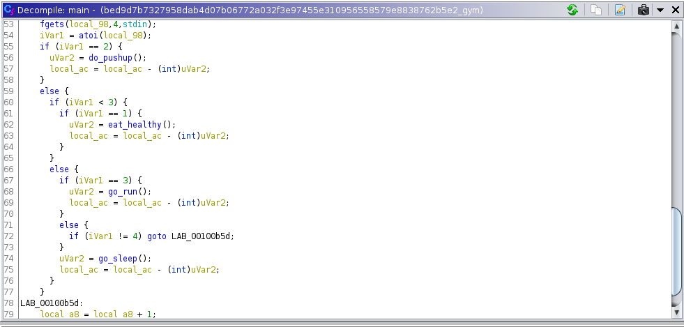
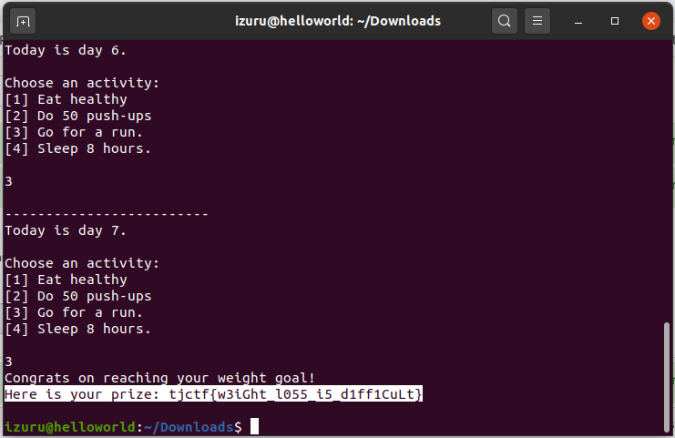

# Gym - 20 points
## Description
Aneesh wants to acquire a summer bod for beach week, but time is running out. Can you help him [create a plan](https://static.tjctf.org/bed9d7b7327958dab4d07b06772a032f3e97455e310956558579e8838762b5e2_gym) to attain his goal?

`nc p1.tjctf.org 8008`

## Flag
```
tjctf{w3iGht_l055_i5_d1ff1CuLt}
```
## Solution


Gambar diatas merupakan tampilan dari file yang telah diunduh dari lampiran soal ketika di `decompile` menggunakan aplikasi `ghidra`. Setelah memahami aturan pengurangan setiap kegiatan, maka kita akan mendapatkan hasil akhir yang diinginkan yaitu 180lbs. Saya sendiri menggunakan step `2` `3` `3` `3` `3` `3` `3` untuk menyelesaikannya.


