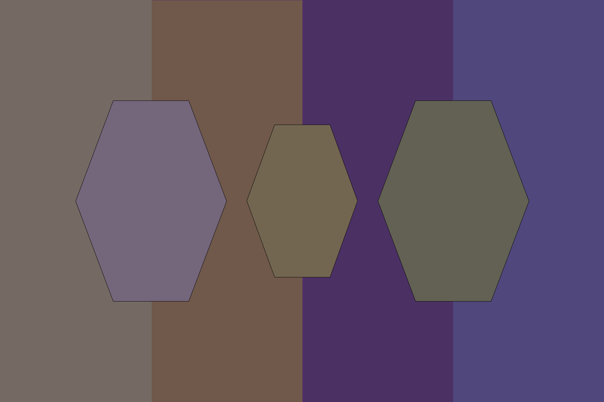

# Hexillology - 25 points
## Description
I recently designed a new [flag](https://static.tjctf.org/af83861c918131864a4e3df24c49d9bad766ae701f02387ee0698593b44f3390_Hexillology.png) for my imaginary nation, Hexistan. Do you like it?
## Flag
```
tjctf{c0lorfu1_fl4g!}
```
## Solution


Dari soal terdapat hint `hex`. Disini saya menggunakan hex detector online untuk memperoleh nilainya. Setelah itu tinggal diurutkan dari kiri ke kanan. Kode hexadecimal yang didapat adalah `746a63 74667b 63306c 6f7266 75315f 666c34 67217d`. [Konversikan](http://www.unit-conversion.info/texttools/hexadecimal/) ke text biasa.
