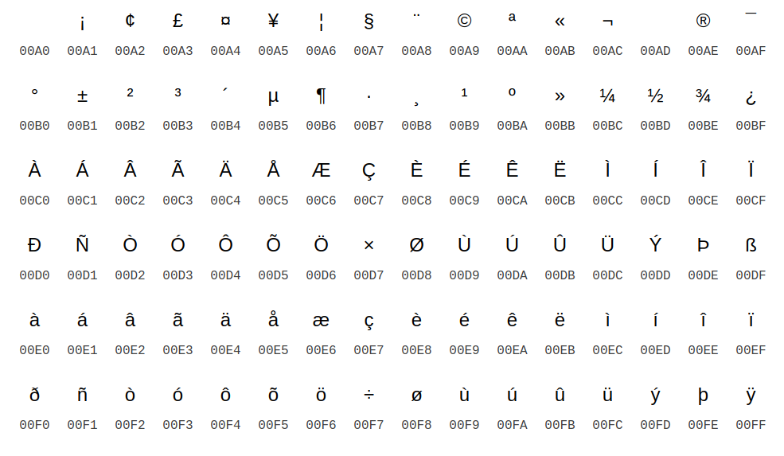

# Is This Crypto? - 50 points
## Description
[Is this crypto?](https://static.tjctf.org/e141851decd4f7afab034c7055db229bd54011d2860ebd622302088fd4e062ae_file.txt)
## Flag
```
tjctf{n0_th15_is_kyl3}
```
## Solution


Melalui gambar diatas kita dapat menerjemahkan kata yang ada dalam soal. Untuk mempermudahnya, dapat menggunakan decoder caesar cipher dengan mensubtitusikan kata tersebut dalam kata biasa.
