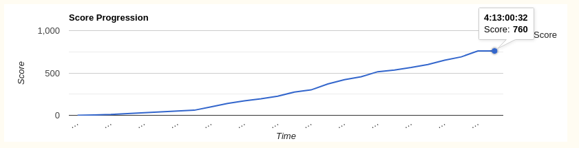
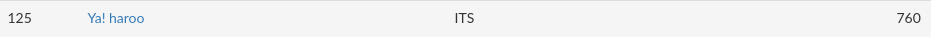

# Dokumentasi TJCTF 2020 - Team: Ya! haroo

## Problem List
- I. Miscellaneous
    - [1.1. Zipped Up](./Zipped-Up/README.md)
    - [1.2. arabfunny](./arabfunny/README.md)
    - [1.3. Censorship](./Censorship/README.md)
    - [1.4. Discord](./Discord/README.md)
    - [1.5. A First Step](./A-First-Step/README.md)
- II. Web
    - [2.1. File Viewer](./File-Viewer/README.md)
    - [2.2. Gamer W](./Gamer-W/README.md)
    - [2.3. Weak Password](./Weak-Password/README.md)
    - [2.4. Sarah Palin Fanpage](./Sarah-Palin-Fanpage/README.md)
    - [2.5. Login](./Login/README.md)
    - [2.6. Broken Button](./Broken-Button/README.md)
- III. Cryptography
    - [3.1. RSABC](./RSABC/README.md)
    - [3.2. Is This Crypto?](./Is-This-Crypto/README.md)
    - [3.3. Titanic](./Titanic/README.md)
    - [3.4. Typewriter](./Typewriter/README.md)
    - [3.5. Tap Dancing](./Tap-Dancing/README.md)
    - [3.6. Speedrunner](./Speedrunner/README.md)
    - [3.7. Circles](./Circles/README.md)
- IV. Reversing
    - [4.1. Chord Encoder](./Chord-Encoder/README.md)
    - [4.2. Gym](./Gym/README.md)
    - [4.3. Forwarding](./Forwarding/README.md)
- V. Forensics
    - [5.1. Rap God](./Rap-God/README.md)
    - [5.2. Hexillology](./Hexillology/README.md)
    - [5.3. Ling Ling](./Ling-Ling/README.md)

## Score Progression

## Rank

