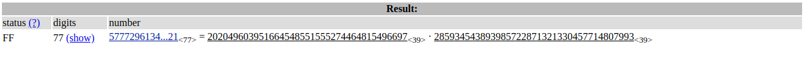

# RSABC - 50 points
## Description
I was just listening to some [relaxing ASMR](https://youtu.be/J2g3lvNkAfI) when a notification popped up with [this](https://static.tjctf.org/68f148e8d4b5ceb8f9fa6da568db024c28b80b55891fba49880b76b35d436114_rsa.txt).

???
## Flag
```
tjctf{BOLm1QMWi3c}
```
## Solution


Dalam file di lampiran soal terdapat nilai `n` yang akan kita lakukan perhitungan dengan bantuan [factordb](http://factordb.com/) dan akan menghasilkan nilai seperti pada gambar diatas. Lakukanlah dekripsi menggunakan kode ruby yang telah disediakan.

(jangan lupa untuk mengganti nilai `n`, `e`, `c`, `p`, `q` pada kode ruby nya)
```
$ ruby solve.rb
```
