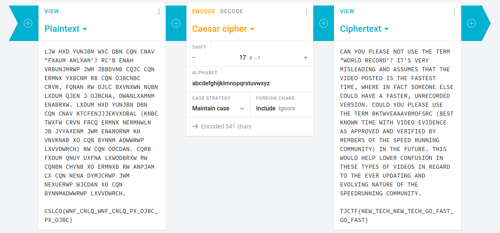

# Speedrunner - 10 points
## Description
I want to make it into the hall of fame -- a top runner in "The History of American Dad Speedrunning". But to do that, I'll need to be faster. I found some [weird parts](https://static.tjctf.org/6e61ec43e56cff1441f4cef46594bf75869a2c66cb47e86699e36577fbc746ff_encoded.txt) in the American Dad source code. I think it might help me become the best.
## Flag
```
TJCTF{NEW_TECH_NEW_TECH_GO_FAST_GO_FAST}
```
## Solution


Melihat dari susunan katanya, dapat dicurigai bahwa ciphertext yang diberikan menggunakan metode caesar cipher. Maka dicobalah untuk mendekripsi pesan tersebut di salah satu tools dekripsi online ([cryptii](https://cryptii.com/pipes/caesar-cipher)) dan dengan shift-17 (a to r) ditemukanlah pesan seperti gambar diatas.
