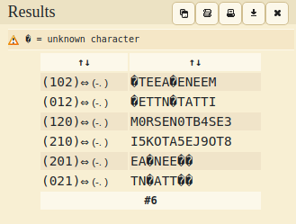

# Tap Dancing - 25 points
## Description
My friend is trying to teach me to dance, but I am not rhythmically coordinated! They sent me a list of [dance moves](https://static.tjctf.org/518d6851c71c5482dbd5bbe812b678684238c8f4e9e9b3d95a188f7db83a0870_cipher.txt) but they're all numbers! Can you help me figure out what they mean so I can learn the dance?

NOTE: Flag is not in flag format.
## Flag
```
tjctf{M0RSEN0TB4SE3}
```
## Solution


Ketika membuka file yang telah dilampirkan pada soal, terdapat ciphertext yang berupa kombinasi 3 angka. Dicurigai bahwa kombinasi tersebut merupakan kombinasi dari sandi morse. Namun karena kita tidak tau harus diganti dengan simbol yang mana 3 jenis angka tersebut, maka kita membutuhkan suatu tool pembantu ([dcode](https://www.dcode.fr/morse-code)). Setelah melakukan penerjemahan, maka akan menemukan beberapa kombinasi yang salah satunya akan menjadi flag nya.
