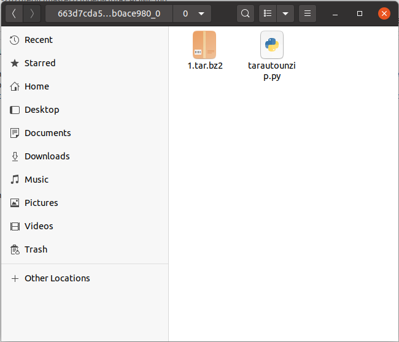
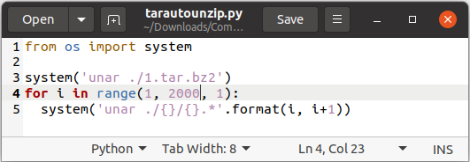
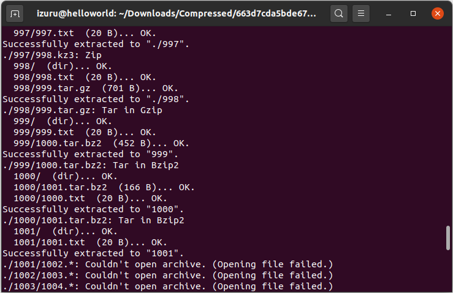
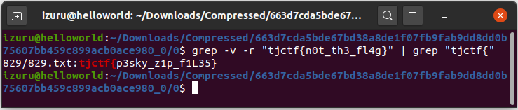

# Zipped Up - 70 points
## Description
My friend changed the password of his Minecraft account that I was using so that I would stop being so addicted. Now he wants me to work for the password and sent me this [zip file](https://static.tjctf.org/663d7cda5bde67bd38a8de1f07fb9fab9dd8dd0b75607bb459c899acb0ace980_0.zip). I tried unzipping the folder, but it just led to another zipped file. Can you find me the password so I can play Minecraft again?
## Flag
```
tjctf{p3sky_z1p_f1L35}
```
## Solution


Ekstrak terlebih dahulu `zipfile` yang kita dapatkan dari lampiran soal. Lalu masukkan kode python yang telah saya berikan pada folder `0`.



Yang perlu diketahui pada kode python ini adalah ekstensi dari file dan perkiraan unzipping yang dilakukan. Jangan lupa pula untuk menginstal `unar` dengan cara:
```
$ sudo apt install unar
```



Karena perkiraan saya 2000 zipfile, sedangkan hanya 1001 zipfile yang ter-unzip maka setelah itu akan terjadi kegagalan.



Terdapat sedikit jebakan di soal ini. Setiap folder memiliki flag tipuan yang mencegah kita mengetahui dmana flag sebenarnya berada. Namun dapat kita manipulasi menggunakan `grep`
```
$ grep -v -r "tjctf{n0t_th3_fl4g}" | grep "tjctf{"
```
