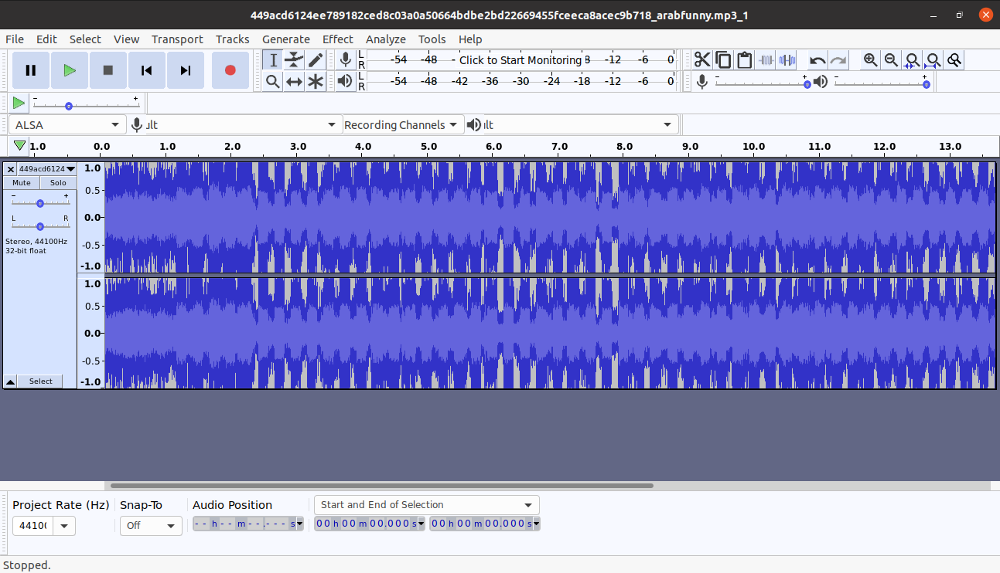
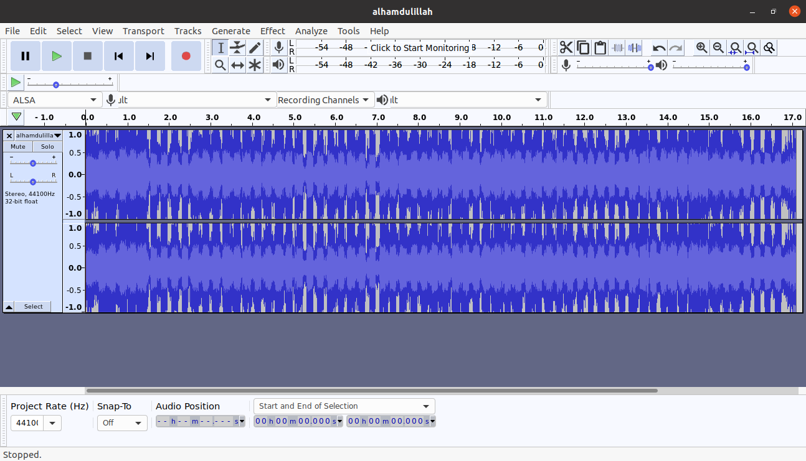
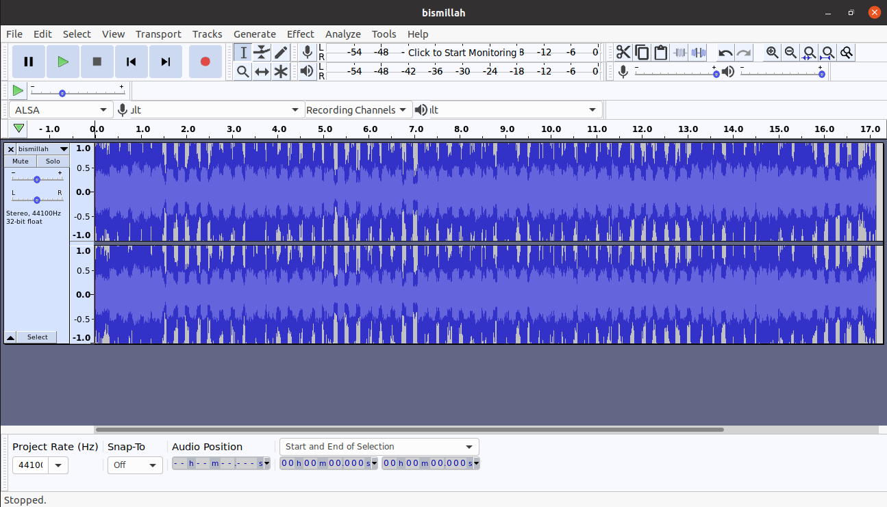

# arabfunny - 10 points
## Description
So many sounds...
## Flag
```
tjctf{bruh_camel_240p}
```
## Solution


Bukalah audio file menggunakan audacity. Temukan kode berupa suara nomor telepon. Ambil bagian itu.




Disini saya membuat dua file `.wav` yang berisi suara nomor telepon tersebut karena tidak jarang suaranya berbeda frekuensi. Tidak percaya? mari kita buktikan menggunakan tool [Detect DTMF Tones](http://www.dialabc.com/sound/detect/index.html).

Hasil 1:
```
116 106 099 116 100 212 309 811 411 710 409 500 990 971 091 011 080 959 500 520 488 112 125
```
Hasil 2:
```
116 106 099 116 102 123 098 114 117 100 409 009 909 710 910 110 809 505 005 204 811 212 55
```

Kombinasikan kedua hasil tersebut, gunakan tool penerjemahan decimal ke text. Setelah beberapa kali mencoba akhirnya mendapatkan hasil yang kombinasi yang benar yaitu
```
116 106 099 116 102 123 098 114 117 104 095 099 097 109 101 108 095 050 052 048 112 125
```
